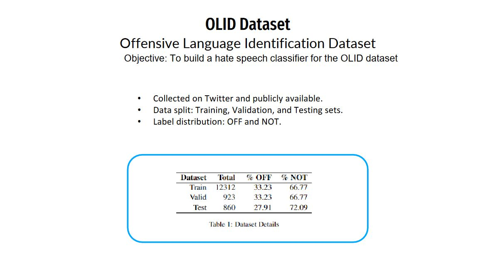
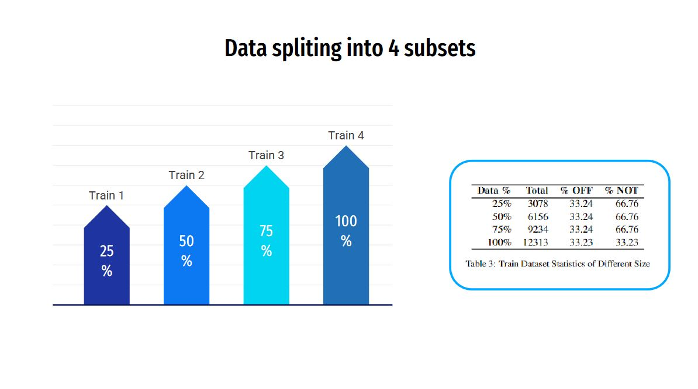
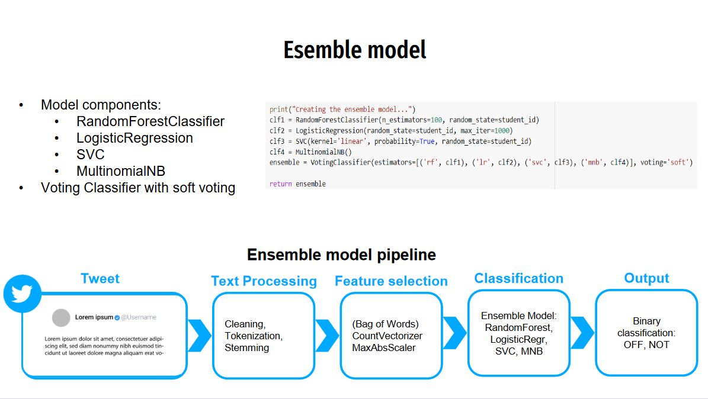
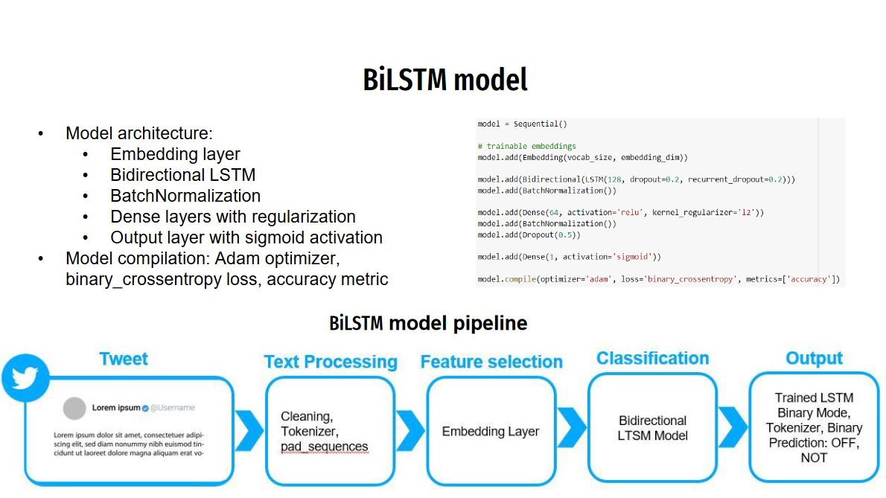
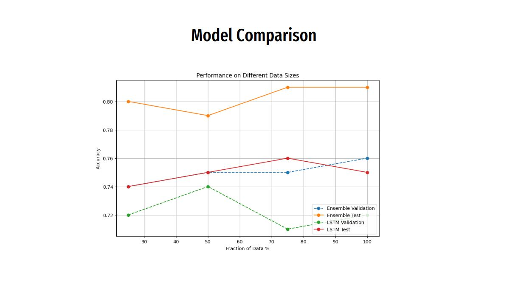
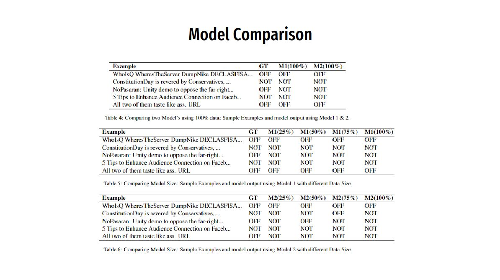

# Hate-Speech-Detector

## Introduction
This report presents an investigation that has been conducted on the OLID (Zampieri et al., 2019) dataset. The project aims to detect hate speech using machine learning and data analysis techniques.

## Dataset
- **OLID (Zampieri et al., 2019)**: A comprehensive dataset that contains labeled examples of hate speech and non-hate speech.

## Technology Stack
- Python
- Scikit-learn
- TensorFlow
- NLP Libraries
- Data Visualization Libraries

## Installation
1. Clone the repository: `git clone https://github.com/your-username/Hate-Speech-Detector.git`
2. Navigate to the project directory
3. Install required packages: `pip install -r requirements.txt`
4. Run the main script: `python main.py`

## Results
For a quick overview of the results, please refer to the following slide images.

## Acknowledgments
Special thanks to Zampieri et al. for the OLID dataset and to all contributors of the libraries and tools used in this project.

